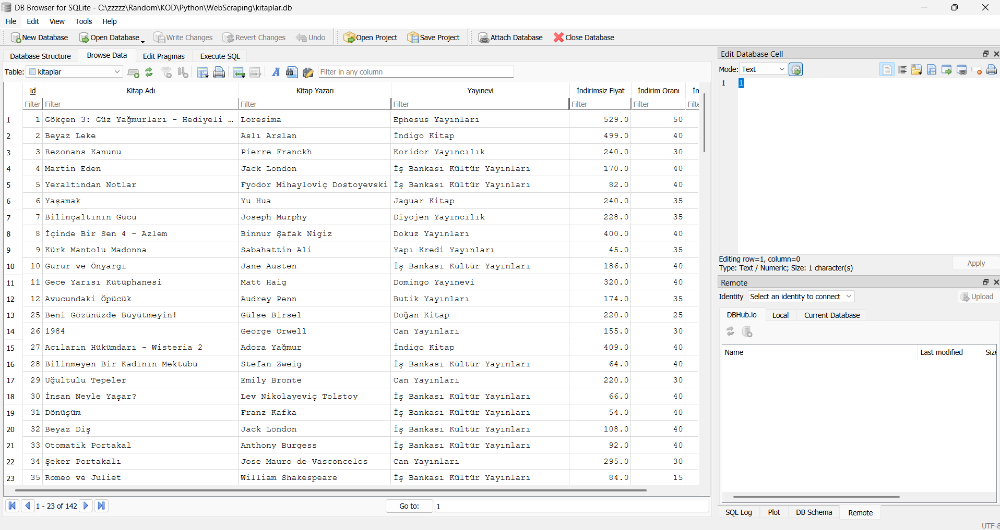
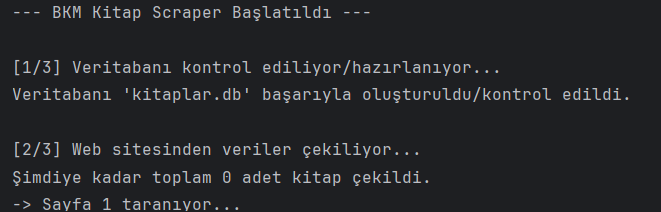
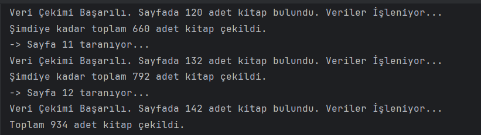
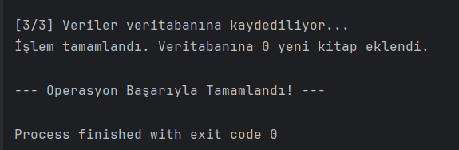
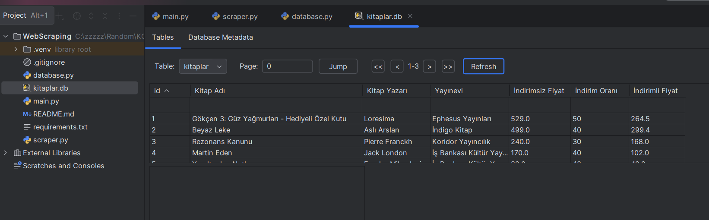

# 📚 BKM Kitap - Akıllı Çok Satanlar Scraper'ı



Bu proje, **BKM Kitap** web sitesinin "Çok Satanlar" bölümündeki kitapları tarayan, elde ettiği verileri temizleyip yapılandıran ve bunları **akıllı bir şekilde bir SQLite veritabanına kaydeden** bir Python uygulamasıdır.

---

## 🚀 Anahtar Özellikler

* 🧭 **Sayfalandırma (Pagination) Desteği:**
  Sitedeki tüm “çok satanlar” sayfalarını (`?ps=1`, `?ps=2`, …) otomatik olarak gezer ve tüm kitapları toplar.

* 🧠 **Akıllı Veri Kaydı (Veri Tekrarını Önleme):**
  Veritabanı, kitap adı ve yazar bilgilerini benzersiz (`UNIQUE`) kabul eder.
  Script yeniden çalıştırıldığında mevcut kitapları **yeniden eklemez**, yalnızca yeni kitapları kaydeder.

* 🥹 **Temiz ve Yapılandırılmış Veri:**
  Her kitaba ait şu bilgiler toplanır ve kaydedilmeden önce normalize edilir:

  * Kitap Adı
  * Yazar
  * Yayınevi
  * Fiyat (`REAL`)
  * İndirimsiz Fiyat (`REAL`)
  * İndirim Oranı (`INTEGER`)

* 🔍 ** İnteraktif Arama ve Listeleme Fonksiyonu:**
  Veritabanına kaydedilen kitapların ismi, yazarın ismi ya da yayınevi aratılarak bulunan sonuçların listelenmesini sağlar.

  *Kısmi Eşleşme: Arama terimini içeren tüm kayıtları bulur (örneğin, "Kanun" araması "Rezonans Kanunu"nu bulur).

  *Büyük/Küçük Harf Duyarsız: Arama, büyük/küçük harf farkı gözetmeksizin yapılır (`LOWER()` fonksiyonu kullanılarak).


* 🧩 **Modüler Tasarım:**
  Kod; `scraper.py`, `database.py`, `main.py` olarak modüllere ayrılmıştır.
  Bu sayede **okunabilirlik**, **yeniden kullanılabilirlik** ve **bakım kolaylığı** sağlanır.

* 🛡️ **Sağlam Hata Yönetimi:**
  `try...except` blokları ile ağ hataları veya parse hataları durumunda program güvenli bir şekilde sonlanır.

---

## 🧪 Kullanılan Teknolojiler

| Teknoloji          | Açıklama                      |
| ------------------ | ----------------------------- |
| **Python 3**       | Ana programlama dili          |
| **Requests**       | HTTP istekleri için           |
| **BeautifulSoup4** | HTML ayrıştırma ve veri çekme |
| **SQLite3**        | Yerel veritabanı yönetimi     |

---

## ⚙️ Kurulum ve Kullanım

### 1. Projeyi Klonlayın

```bash
# HTTPS URL’ini kendi GitHub projenizinkiyle değiştirin
git clone https://github.com/KurdoJotaro/WebScrapingTutorialProject
cd WebScrapingTutorialProject
```

### 2. Sanal Ortam Oluşturun ve Aktif Edin

```bash
# Sanal ortam oluştur
python -m venv .venv

# Windows
.venv\Scripts\activate

# macOS / Linux
source .venv/bin/activate
```

### 3. Gerekli Kütüphaneleri Yükleyin

```bash
pip install -r requirements.txt
```

### 4. Uygulamayı Çalıştırın

```bash
python main.py
```

✅ Çalışma tamamlandığında, proje klasörünüzde `kitaplar.db` adında bir veritabanı dosyası oluşacaktır.
Script yeniden çalıştırıldığında, sadece **yeni kitaplar** eklenecek ve terminalde ilgili bilgilendirme mesajı görünecektir.

---






## 🧑‍💻 Geliştirici Notları

* `database.py` dosyası, SQLite bağlantısı ve tablo yönetiminden sorumludur.
* `scraper.py` dosyası, HTTP isteklerini ve HTML parse işlemini yürütür.
* `main.py` dosyası, tüm süreci koordine eder.

---

## 📜 Lisans

Bu proje açık kaynaklıdır. Dilerseniz kendi projenizde serbestçe uyarlayabilirsiniz.

---
